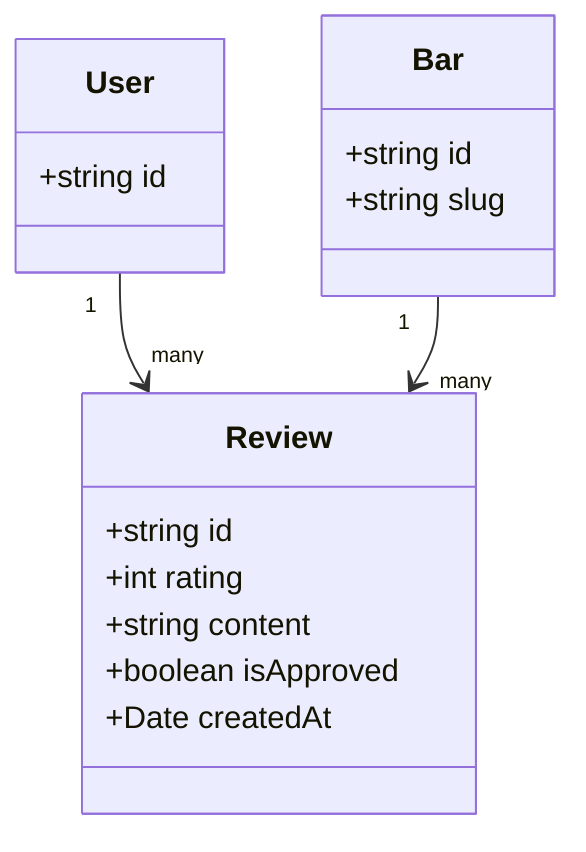

# UC013 — Domain Model (DM)

```mermaid
classDiagram
  class User {
    +string id
  }

  class Bar {
    +string id
    +string slug
  }

  class Review {
    +string id
    +int rating
    +string content
    +boolean isApproved
    +Date createdAt
  }

  User "1" --> "many" Review
  Bar "1" --> "many" Review
```
