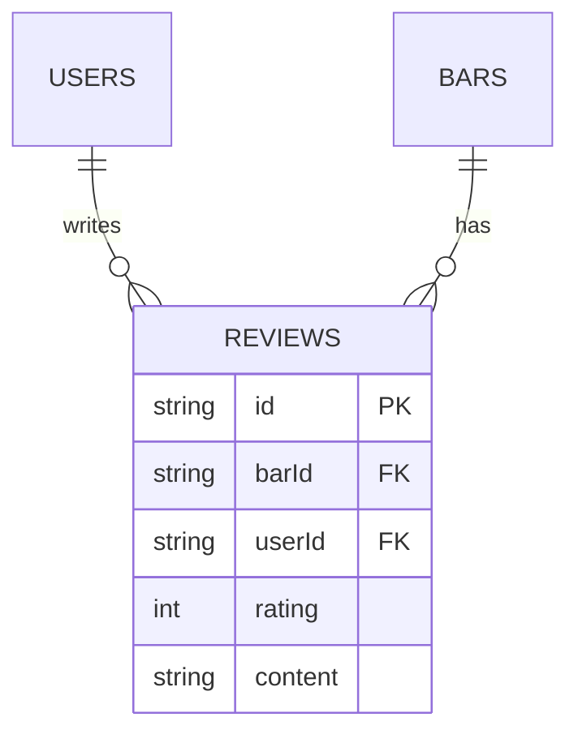

# UC013 — Entity Relationship Diagram (ERD)

```mermaid
erDiagram
  USERS ||--o{ REVIEWS : writes
  BARS ||--o{ REVIEWS : has

  REVIEWS {
    string id PK
    string barId FK
    string userId FK
    int rating
    string content
  }
```

Notes:

- One review per `(barId, userId)` enforced via `@@unique([barId, userId])`.
