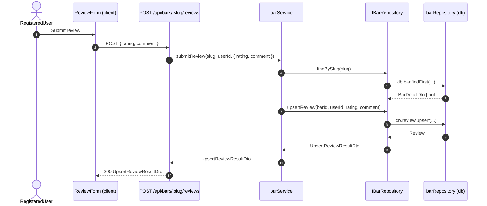

# UC013 — Sequence Diagram (SD)

```mermaid
sequenceDiagram
  autonumber
  actor RegisteredUser
  participant UI as ReviewForm (client)
  participant API as POST /api/bars/:slug/reviews
  participant Service as barService
  participant Repo as IBarRepository
  participant Prisma as barRepository (db)

  RegisteredUser->>UI: Submit review
  UI->>API: POST { rating, comment }
  API->>Service: submitReview(slug, userId, { rating, comment })
  Service->>Repo: findBySlug(slug)
  Repo->>Prisma: db.bar.findFirst(...)
  Prisma-->>Repo: BarDetailDto | null
  Service->>Repo: upsertReview(barId, userId, rating, comment)
  Repo->>Prisma: db.review.upsert(...)
  Prisma-->>Repo: Review
  Repo-->>Service: UpsertReviewResultDto
  Service-->>API: UpsertReviewResultDto
  API-->>UI: 200 UpsertReviewResultDto
```
