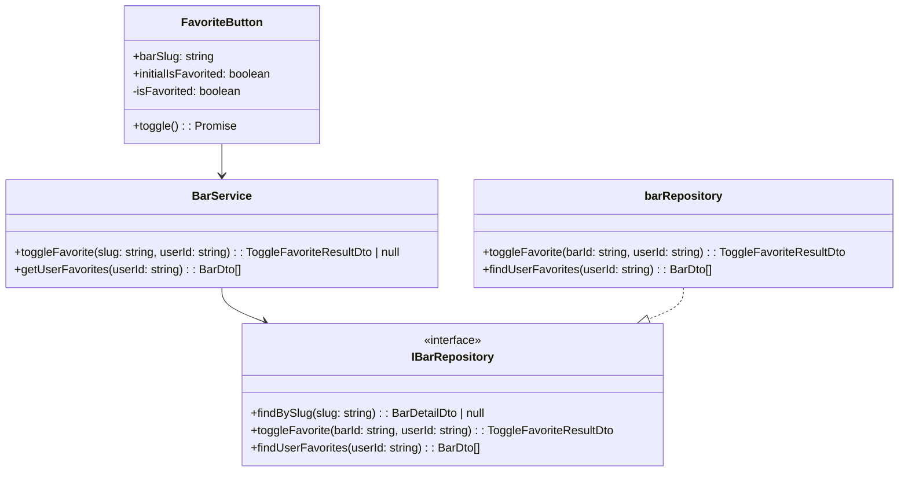

# UC014 — Design Class Diagram

```mermaid
classDiagram
  class FavoriteButton {
    +barSlug: string
    +initialIsFavorited: boolean
    -isFavorited: boolean
    +toggle(): Promise<void>
  }

  class BarService {
    +toggleFavorite(slug: string, userId: string): ToggleFavoriteResultDto | null
    +getUserFavorites(userId: string): BarDto[]
  }

  class IBarRepository {
    <<interface>>
    +findBySlug(slug: string): BarDetailDto | null
    +toggleFavorite(barId: string, userId: string): ToggleFavoriteResultDto
    +findUserFavorites(userId: string): BarDto[]
  }

  class barRepository {
    +toggleFavorite(barId: string, userId: string): ToggleFavoriteResultDto
    +findUserFavorites(userId: string): BarDto[]
  }

  FavoriteButton --> BarService
  BarService --> IBarRepository
  barRepository ..|> IBarRepository
```
