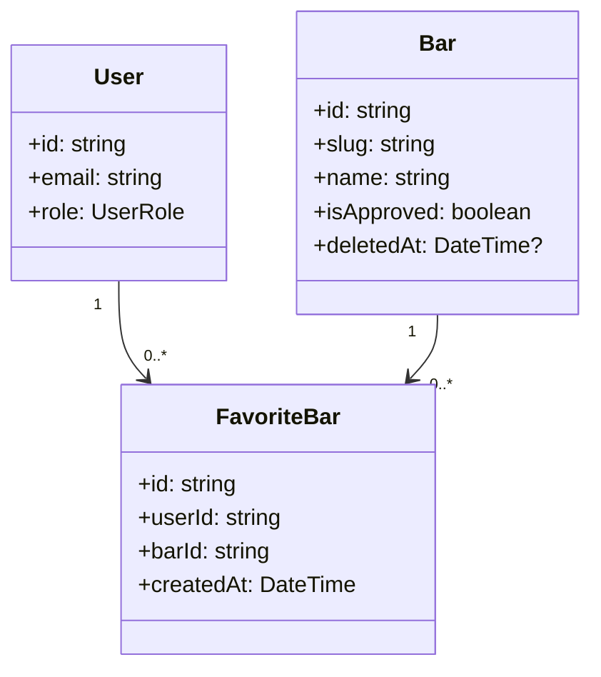

# UC014 — Domain Model

```mermaid
classDiagram
  class User {
    +id: string
    +email: string
    +role: UserRole
  }

  class Bar {
    +id: string
    +slug: string
    +name: string
    +isApproved: boolean
    +deletedAt: DateTime?
  }

  class FavoriteBar {
    +id: string
    +userId: string
    +barId: string
    +createdAt: DateTime
  }

  User "1" --> "0..*" FavoriteBar
  Bar "1" --> "0..*" FavoriteBar
```
