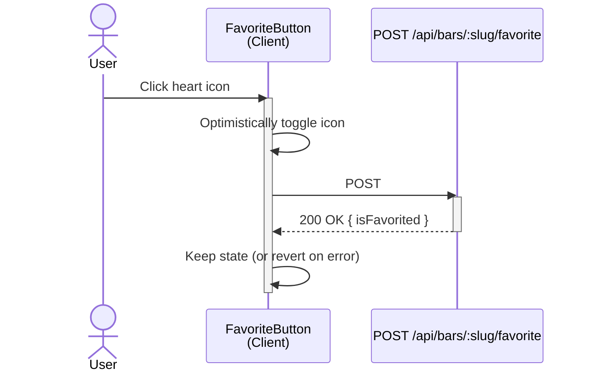

# UC014 — System Sequence Diagram

```mermaid
sequenceDiagram
  actor User
  participant UI as FavoriteButton<br/>(Client)
  participant API as POST /api/bars/:slug/favorite

  User->>UI: Click heart icon
  activate UI
  UI->>UI: Optimistically toggle icon
  UI->>API: POST
  activate API
  API-->>UI: 200 OK { isFavorited }
  deactivate API
  UI->>UI: Keep state (or revert on error)
  deactivate UI
```
