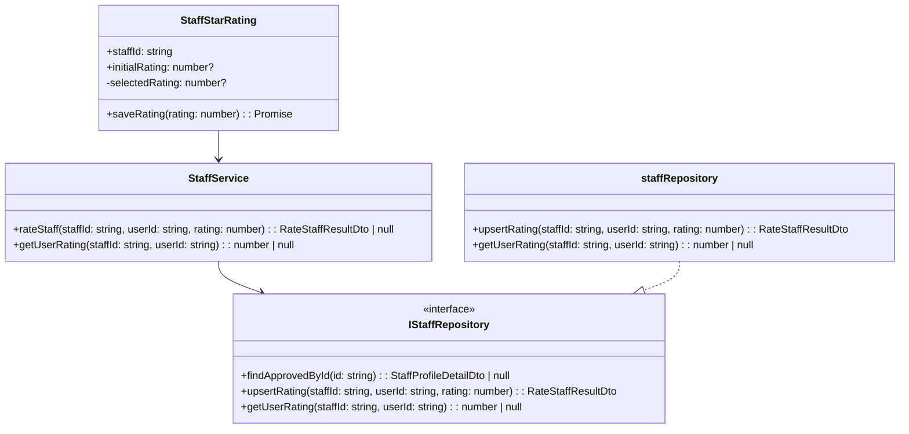

# UC015 — Design Class Diagram

```mermaid
classDiagram
  class StaffStarRating {
    +staffId: string
    +initialRating: number?
    -selectedRating: number?
    +saveRating(rating: number): Promise<void>
  }

  class StaffService {
    +rateStaff(staffId: string, userId: string, rating: number): RateStaffResultDto | null
    +getUserRating(staffId: string, userId: string): number | null
  }

  class IStaffRepository {
    <<interface>>
    +findApprovedById(id: string): StaffProfileDetailDto | null
    +upsertRating(staffId: string, userId: string, rating: number): RateStaffResultDto
    +getUserRating(staffId: string, userId: string): number | null
  }

  class staffRepository {
    +upsertRating(staffId: string, userId: string, rating: number): RateStaffResultDto
    +getUserRating(staffId: string, userId: string): number | null
  }

  StaffStarRating --> StaffService
  StaffService --> IStaffRepository
  staffRepository ..|> IStaffRepository
```
