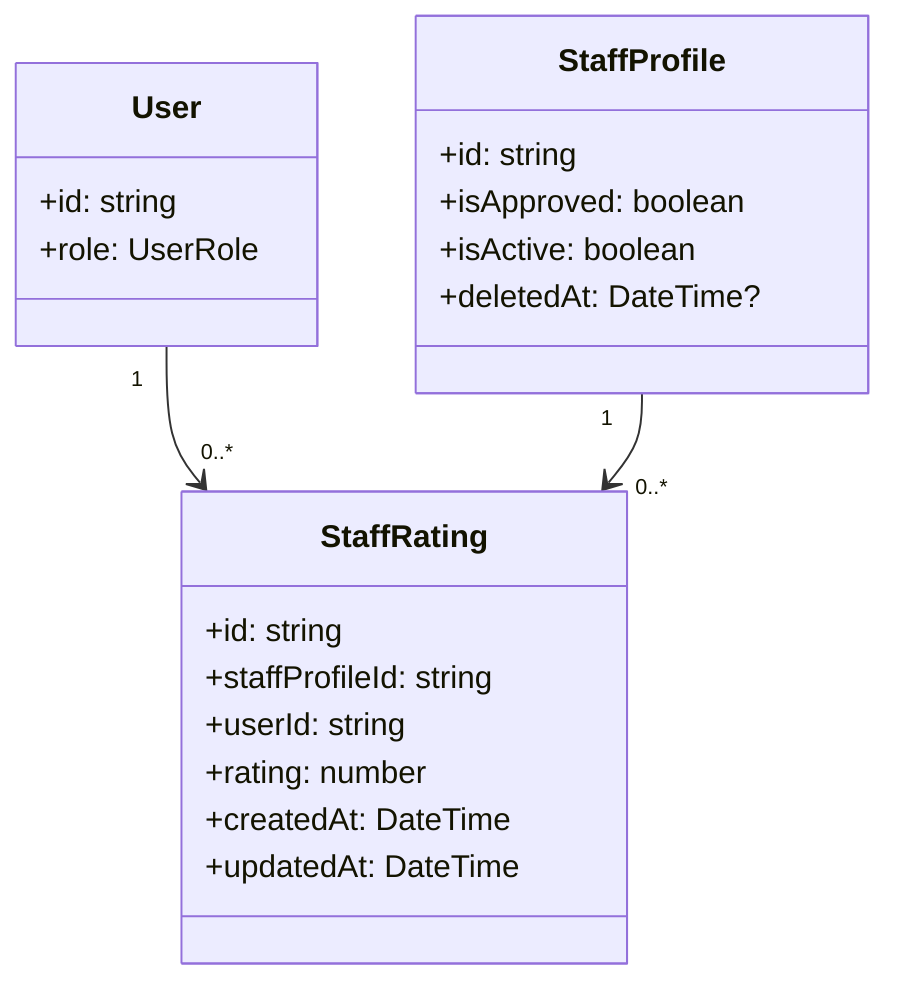

# UC015 — Domain Model

```mermaid
classDiagram
  class User {
    +id: string
    +role: UserRole
  }

  class StaffProfile {
    +id: string
    +isApproved: boolean
    +isActive: boolean
    +deletedAt: DateTime?
  }

  class StaffRating {
    +id: string
    +staffProfileId: string
    +userId: string
    +rating: number
    +createdAt: DateTime
    +updatedAt: DateTime
  }

  User "1" --> "0..*" StaffRating
  StaffProfile "1" --> "0..*" StaffRating
```
