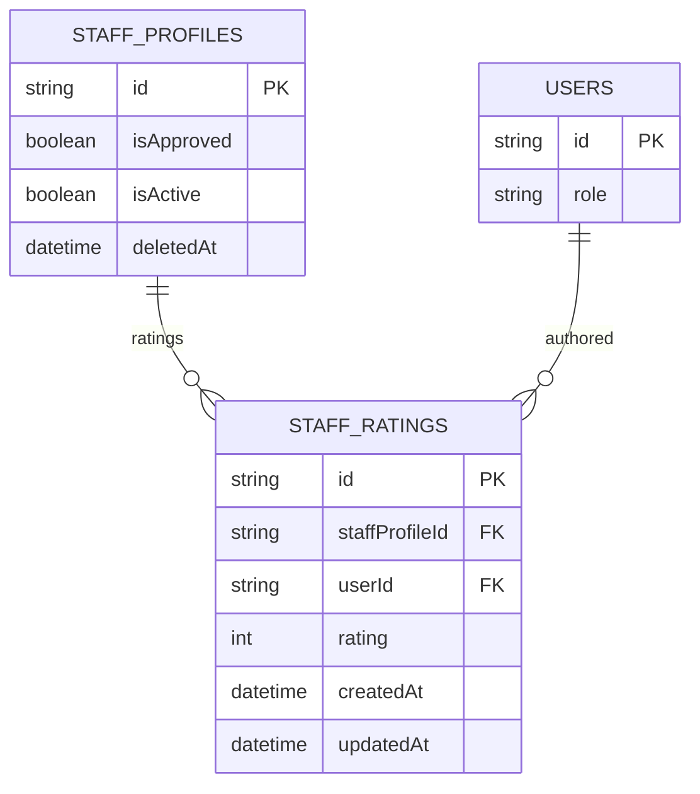

# UC015 — Entity Relationship Diagram

```mermaid
erDiagram
  STAFF_PROFILES ||--o{ STAFF_RATINGS : ratings
  USERS ||--o{ STAFF_RATINGS : authored

  STAFF_PROFILES {
    string id PK
    boolean isApproved
    boolean isActive
    datetime deletedAt
  }

  USERS {
    string id PK
    string role
  }

  STAFF_RATINGS {
    string id PK
    string staffProfileId FK
    string userId FK
    int rating
    datetime createdAt
    datetime updatedAt
  }
```
