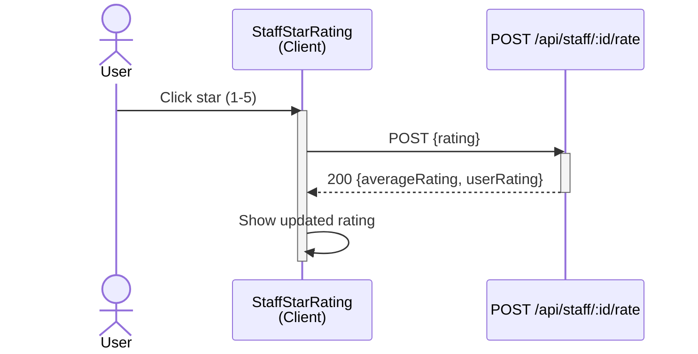

# UC015 — System Sequence Diagram

```mermaid
sequenceDiagram
  actor User
  participant UI as StaffStarRating<br/>(Client)
  participant API as POST /api/staff/:id/rate

  User->>UI: Click star (1-5)
  activate UI
  UI->>API: POST {rating}
  activate API
  API-->>UI: 200 {averageRating, userRating}
  deactivate API
  UI->>UI: Show updated rating
  deactivate UI
```
