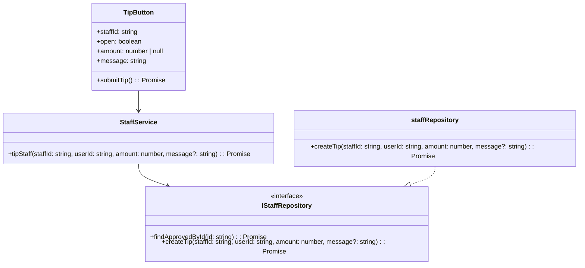

# UC016 — Design Class Diagram (DCD)

```mermaid
classDiagram
  class TipButton {
    +staffId: string
    +open: boolean
    +amount: number | null
    +message: string
    +submitTip(): Promise<void>
  }

  class StaffService {
    +tipStaff(staffId: string, userId: string, amount: number, message?: string): Promise<TipStaffResultDto | null>
  }

  class IStaffRepository {
    <<interface>>
    +findApprovedById(id: string): Promise<StaffProfileDetailDto | null>
    +createTip(staffId: string, userId: string, amount: number, message?: string): Promise<string>
  }

  class staffRepository {
    +createTip(staffId: string, userId: string, amount: number, message?: string): Promise<string>
  }

  TipButton --> StaffService
  StaffService --> IStaffRepository
  staffRepository ..|> IStaffRepository
```
