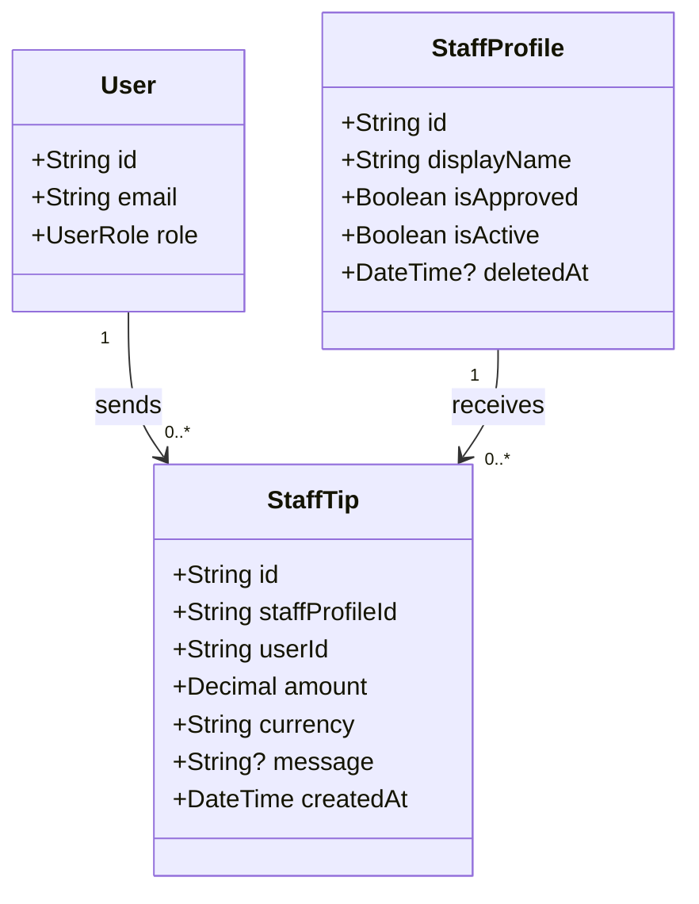

# UC016 — Domain Model (DM)

```mermaid
classDiagram
  class User {
    +String id
    +String email
    +UserRole role
  }

  class StaffProfile {
    +String id
    +String displayName
    +Boolean isApproved
    +Boolean isActive
    +DateTime? deletedAt
  }

  class StaffTip {
    +String id
    +String staffProfileId
    +String userId
    +Decimal amount
    +String currency
    +String? message
    +DateTime createdAt
  }

  User "1" --> "0..*" StaffTip : sends
  StaffProfile "1" --> "0..*" StaffTip : receives
```
