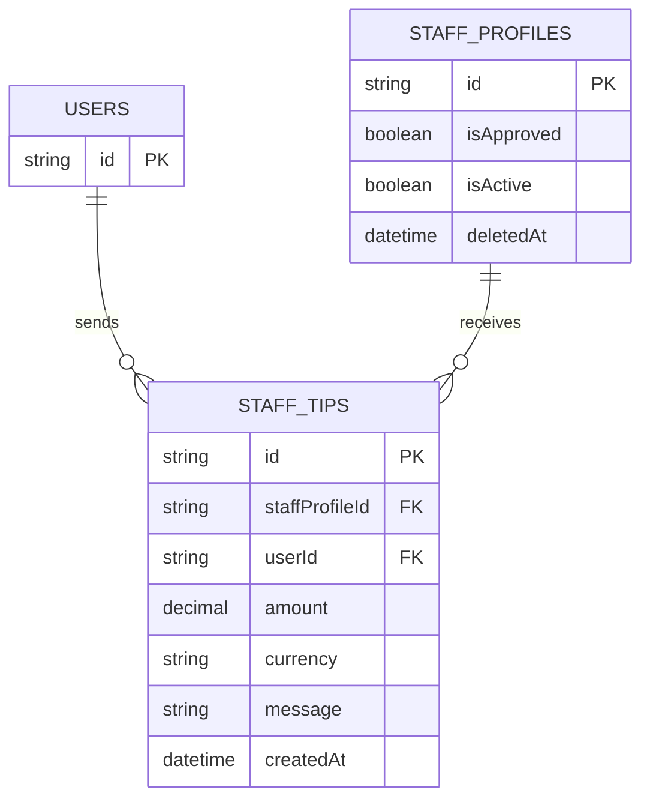

# UC016 — Entity Relationship Diagram (ERD)

```mermaid
erDiagram
  USERS ||--o{ STAFF_TIPS : sends
  STAFF_PROFILES ||--o{ STAFF_TIPS : receives

  USERS {
    string id PK
  }

  STAFF_PROFILES {
    string id PK
    boolean isApproved
    boolean isActive
    datetime deletedAt
  }

  STAFF_TIPS {
    string id PK
    string staffProfileId FK
    string userId FK
    decimal amount
    string currency
    string message
    datetime createdAt
  }
```
