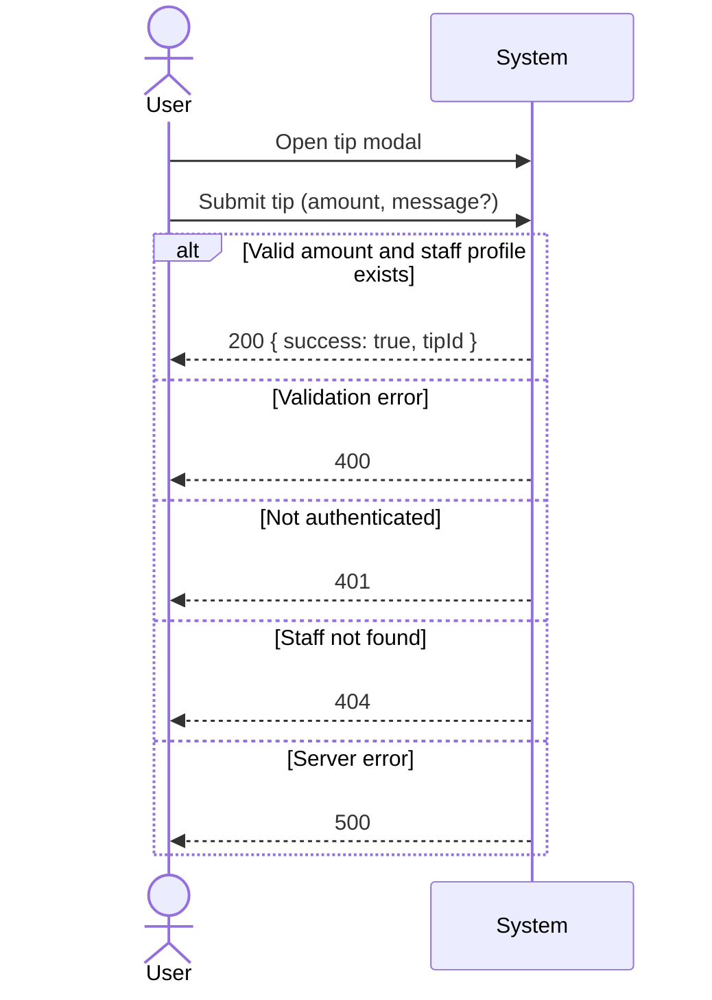

# UC016 — System Sequence Diagram (SSD)

```mermaid
sequenceDiagram
  actor User
  participant System

  User->>System: Open tip modal
  User->>System: Submit tip (amount, message?)
  alt Valid amount and staff profile exists
    System-->>User: 200 { success: true, tipId }
  else Validation error
    System-->>User: 400
  else Not authenticated
    System-->>User: 401
  else Staff not found
    System-->>User: 404
  else Server error
    System-->>User: 500
  end
```
