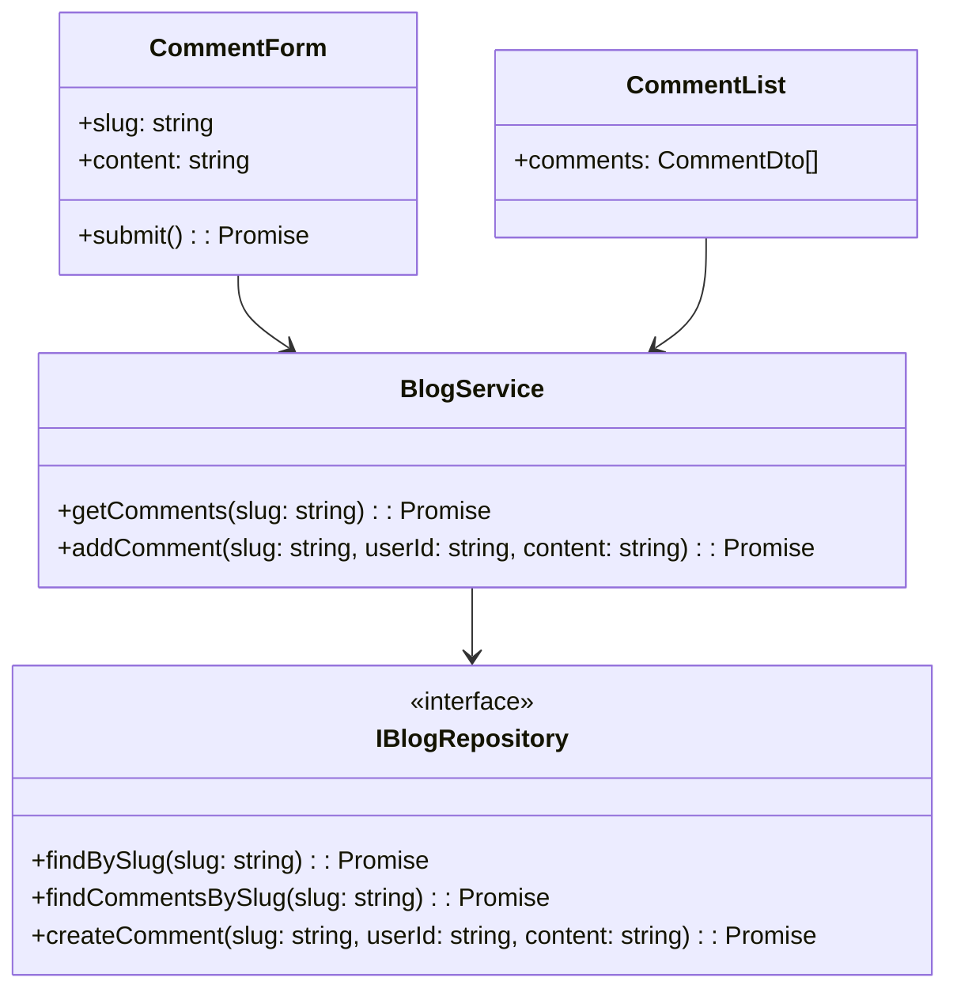

# UC017 — Design Class Diagram (DCD)

```mermaid
classDiagram
  class CommentForm {
    +slug: string
    +content: string
    +submit(): Promise<void>
  }

  class CommentList {
    +comments: CommentDto[]
  }

  class BlogService {
    +getComments(slug: string): Promise<CommentDto[]>
    +addComment(slug: string, userId: string, content: string): Promise<CommentDto | null>
  }

  class IBlogRepository {
    <<interface>>
    +findBySlug(slug: string): Promise<BlogPostDto | null>
    +findCommentsBySlug(slug: string): Promise<CommentDto[]>
    +createComment(slug: string, userId: string, content: string): Promise<CommentDto>
  }

  CommentForm --> BlogService
  CommentList --> BlogService
  BlogService --> IBlogRepository
```
