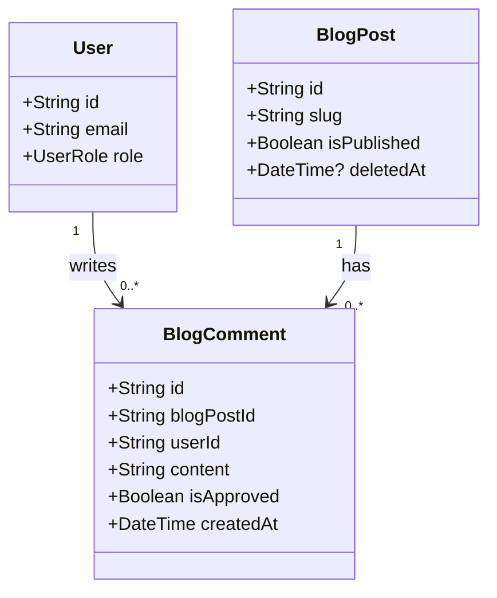

# UC017 — Domain Model (DM)

```mermaid
classDiagram
  class User {
    +String id
    +String email
    +UserRole role
  }

  class BlogPost {
    +String id
    +String slug
    +Boolean isPublished
    +DateTime? deletedAt
  }

  class BlogComment {
    +String id
    +String blogPostId
    +String userId
    +String content
    +Boolean isApproved
    +DateTime createdAt
  }

  User "1" --> "0..*" BlogComment : writes
  BlogPost "1" --> "0..*" BlogComment : has
```
