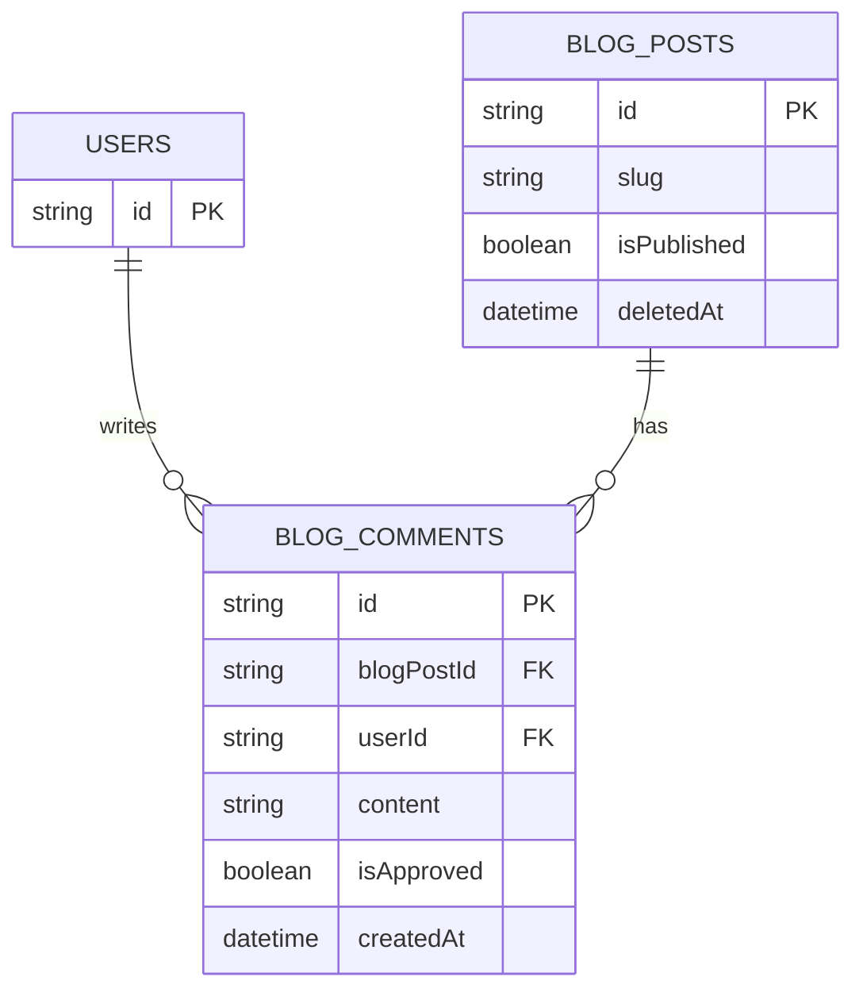

# UC017 — Entity Relationship Diagram (ERD)

```mermaid
erDiagram
  USERS ||--o{ BLOG_COMMENTS : writes
  BLOG_POSTS ||--o{ BLOG_COMMENTS : has

  USERS {
    string id PK
  }

  BLOG_POSTS {
    string id PK
    string slug
    boolean isPublished
    datetime deletedAt
  }

  BLOG_COMMENTS {
    string id PK
    string blogPostId FK
    string userId FK
    string content
    boolean isApproved
    datetime createdAt
  }
```
