# UC018 — Design Class Diagram

```mermaid
classDiagram
    %% ============================================================================
    %% PRESENTATION LAYER
    %% ============================================================================

    class RegisterForm {
        +name: string
        +email: string
        +password: string
        +confirmPassword: string
        +errors: ValidationError[]
        +isLoading: boolean
        +handleSubmit() void
        +validateForm() boolean
        +displayError(error) void
    }

    class RegisterAPIRoute {
        +POST(request: Request) Response
        -validateCSRF(request) boolean
        -parseBody(request) RegisterDto
        -handleSuccess(user, token) Response
        -handleError(error) Response
    }

    %% ============================================================================
    %% APPLICATION LAYER
    %% ============================================================================

    class AuthService {
        -userRepository: IUserRepository
        +registerUser(dto: RegisterDto) Promise~UserDto~
        -validateInput(dto) RegisterDto
        -checkEmailUnique(email) Promise~void~
        -hashPassword(password) Promise~string~
        -createSession(user) Promise~string~
    }

    %% ============================================================================
    %% DOMAIN LAYER
    %% ============================================================================

    class IUserRepository {
        <<interface>>
        +findByEmail(email: string) Promise~UserDto | null~
        +create(data: CreateUserData) Promise~UserDto~
        +findById(id: string) Promise~UserDto | null~
    }

    class UserDto {
        <<DTO>>
        +id: string
        +email: string
        +name: string | null
        +role: UserRole
        +emailVerified: Date | null
        +image: string | null
        +createdAt: Date
        +updatedAt: Date
    }

    class RegisterDto {
        <<DTO>>
        +name: string
        +email: string
        +password: string
    }

    class CreateUserData {
        <<DTO>>
        +email: string
        +name: string
        +password: string
        +role: UserRole
    }

    class RegisterSchema {
        <<Zod Schema>>
        +name: ZodString
        +email: ZodString
        +password: ZodString
        +parse(data) RegisterDto
        +safeParse(data) SafeParseResult
    }

    class UserRole {
        <<enum>>
        Visitor
        RegisteredUser
        BarOwner
        BlogWriter
        Staff
        Admin
    }

    class EmailExistsError {
        <<DomainError>>
        +code: "EMAIL_EXISTS"
        +message: string
        +statusCode: 409
    }

    class ValidationError {
        <<DomainError>>
        +code: "VALIDATION_ERROR"
        +message: string
        +issues: Issue[]
        +statusCode: 400
    }

    %% ============================================================================
    %% INFRASTRUCTURE LAYER
    %% ============================================================================

    class UserRepository {
        -db: PrismaClient
        +findByEmail(email) Promise~UserDto | null~
        +create(data) Promise~UserDto~
        +findById(id) Promise~UserDto | null~
        -toUserDto(user: User) UserDto
    }

    class PrismaClient {
        <<external>>
        +user: UserDelegate
    }

    class User {
        <<Prisma Model>>
        +id: string
        +email: string
        +name: string | null
        +password: string
        +role: UserRole
        +emailVerified: Date | null
        +image: string | null
        +createdAt: Date
        +updatedAt: Date
        +deletedAt: Date | null
    }

    class BcryptUtil {
        <<utility>>
        +hash(password: string, rounds: number) Promise~string~
        +compare(password: string, hash: string) Promise~boolean~
    }

    class NextAuthSession {
        <<external>>
        +createSession(user: UserDto) Promise~string~
        +verifySession(token: string) Promise~Session~
    }

    %% ============================================================================
    %% RELATIONSHIPS
    %% ============================================================================

    %% Presentation Layer
    RegisterForm --> RegisterAPIRoute : calls
    RegisterAPIRoute --> AuthService : uses
    RegisterAPIRoute ..> RegisterDto : receives
    RegisterAPIRoute ..> UserDto : returns

    %% Application Layer
    AuthService --> IUserRepository : depends on
    AuthService ..> RegisterDto : uses
    AuthService ..> UserDto : returns
    AuthService ..> CreateUserData : creates
    AuthService --> RegisterSchema : validates with
    AuthService --> BcryptUtil : uses
    AuthService --> NextAuthSession : uses
    AuthService ..> EmailExistsError : throws
    AuthService ..> ValidationError : throws

    %% Domain Layer
    IUserRepository ..> UserDto : returns
    IUserRepository ..> CreateUserData : accepts
    RegisterDto --> UserRole : references
    UserDto --> UserRole : references
    CreateUserData --> UserRole : references

    %% Infrastructure Layer
    UserRepository ..|> IUserRepository : implements
    UserRepository --> PrismaClient : uses
    UserRepository ..> User : receives
    UserRepository ..> UserDto : maps to
    PrismaClient ..> User : returns

    %% Notes
    note for RegisterAPIRoute "NEVER imports db or Prisma\nONLY calls AuthService"
    note for AuthService "NEVER imports db or Prisma\nDepends on IUserRepository interface"
    note for UserRepository "ONLY place that imports Prisma\nALWAYS maps to DTO before returning"
    note for IUserRepository "Pure TypeScript interface\nZERO external dependencies"
```



## Class Descriptions

### Presentation Layer

#### RegisterForm

React component for registration UI. Handles client-side validation, form state, and submission. Never accesses database or services directly.

#### RegisterAPIRoute

Next.js API route handler. Receives HTTP POST request, validates CSRF, calls AuthService, sets session cookie, returns HTTP response. Never imports `db` or Prisma.

---

### Application Layer

#### AuthService

Business logic orchestrator. Validates input, checks email uniqueness through IUserRepository, hashes password, creates user through IUserRepository, creates session. Depends only on interfaces and DTOs.

**Key Methods**:

- `registerUser(dto)`: Main registration flow
- `validateInput(dto)`: Zod schema validation
- `checkEmailUnique(email)`: Throws EmailExistsError if exists
- `hashPassword(password)`: Bcrypt with 10 rounds
- `createSession(user)`: Generate JWT session token

---

### Domain Layer

#### IUserRepository

Pure TypeScript interface defining repository contract. No implementation details. ZERO external dependencies.

#### UserDto

Data Transfer Object that crosses all layer boundaries. Contains user data without sensitive fields (no password, no deletedAt).

#### RegisterDto

Input DTO for registration. Contains name, email, password before processing.

#### CreateUserData

DTO for creating user in database. Contains validated, processed data ready for persistence.

#### RegisterSchema

Zod validation schema enforcing registration business rules:

- Name: 1-100 chars
- Email: valid format, max 255 chars
- Password: 8-72 chars, uppercase, lowercase, number

#### UserRole

Enum defining all user roles. Used across all layers.

#### EmailExistsError

Domain error thrown when email is already registered. Maps to HTTP 409 Conflict.

#### ValidationError

Domain error thrown when input validation fails. Maps to HTTP 400 Bad Request.

---

### Infrastructure Layer

#### UserRepository

Concrete implementation of IUserRepository. ONLY place that imports Prisma. Always maps Prisma User models to UserDto before returning.

**Key Methods**:

- `findByEmail(email)`: Query database, map to DTO or null
- `create(data)`: Insert user, map to DTO
- `toUserDto(user)`: Private mapper function (Prisma User → UserDto)

#### PrismaClient

External dependency. Singleton instance from `@/lib/db.ts`. Never imported outside repositories.

#### User

Prisma-generated model. Contains all database fields including password hash and deletedAt. NEVER leaves the repository layer.

#### BcryptUtil

Wrapper around bcrypt library for password hashing.

#### NextAuthSession

NextAuth.js session management. Creates and validates JWT tokens.

---

## Layer Dependency Rules

```
RegisterForm (Presentation)
    ↓ uses
RegisterAPIRoute (Presentation)
    ↓ uses
AuthService (Application)
    ↓ depends on
IUserRepository (Domain Interface)
    ↑ implemented by
UserRepository (Infrastructure)
    ↓ uses
PrismaClient (Infrastructure)
```

## Data Flow

```
HTTP Request (JSON)
    ↓ parsed to
RegisterDto (Domain)
    ↓ validated by
RegisterSchema (Domain)
    ↓ processed by
AuthService (Application)
    ↓ creates
CreateUserData (Domain)
    ↓ sent to
UserRepository (Infrastructure)
    ↓ creates
User (Prisma Model)
    ↓ mapped to
UserDto (Domain)
    ↓ returned through layers to
HTTP Response (JSON)
```

## Critical Rules Enforced

1. ✅ DTOs cross all boundaries, never Prisma models
2. ✅ Repository is only place that imports Prisma
3. ✅ Service depends on interface, not concrete repository
4. ✅ Domain layer has no external imports
5. ✅ Password hash only happens in service layer
6. ✅ Prisma User model never leaves repository
7. ✅ All validation uses domain Zod schemas
