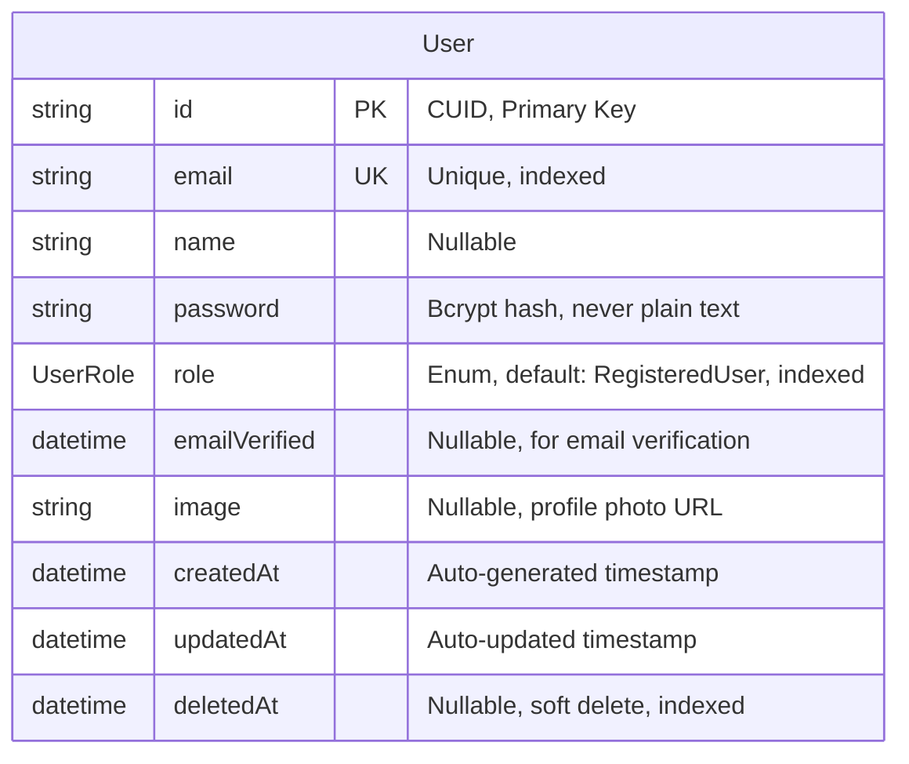

# UC018 — Entity Relationship Diagram



## User Table Details

### Primary Key

- **id** (string, CUID): Collision-resistant unique identifier
  - Format: `clx1234567890abcdef`
  - Generated by: `@default(cuid())`
  - Never null, never changes

### Unique Constraints

- **email** (string, UNIQUE): Case-insensitive unique constraint
  - Stored lowercase: `john@example.com`
  - Indexed for fast lookups
  - Cannot be reused even after soft delete
  - Max length: 255 characters

### Authentication Fields

- **password** (string): Bcrypt hash with salt
  - Format: `$2b$10$N9qo8uLOickgx2ZMRZoMye...`
  - Length: 60 characters (bcrypt output)
  - Salt rounds: 10
  - Never stored or logged as plain text
  - Never returned in API responses or DTOs

### Authorization Field

- **role** (UserRole enum): Determines access permissions
  - Values: Visitor, RegisteredUser, BarOwner, BlogWriter, Staff, Admin
  - Default: RegisteredUser (for new registrations)
  - Indexed for role-based queries
  - Used by middleware for route protection

### Profile Fields

- **name** (string, nullable): User's display name
  - Optional during registration
  - Max length: 100 characters
  - Can be updated later in profile settings

- **image** (string, nullable): Profile photo URL
  - Not collected during registration
  - Can be uploaded later
  - Stored as Cloudinary URL

### Verification Field

- **emailVerified** (datetime, nullable): Email verification timestamp
  - Null on registration (unverified)
  - Set when user clicks verification link
  - Future: required for certain features

### Audit Fields

- **createdAt** (datetime): Account creation timestamp
  - Auto-generated: `@default(now())`
  - Immutable after creation
  - Used for analytics and sorting

- **updatedAt** (datetime): Last modification timestamp
  - Auto-updated: `@updatedAt`
  - Changes on any field update
  - Used for tracking activity

- **deletedAt** (datetime, nullable): Soft delete timestamp
  - Null: active account
  - Not null: soft-deleted account
  - Indexed for filtering queries
  - Prevents email reuse

## Indexes

```sql
CREATE INDEX idx_users_email ON users(email);
CREATE INDEX idx_users_role ON users(role);
CREATE INDEX idx_users_deletedAt ON users(deletedAt);
```

### Index Justification

1. **email index**:
   - Used in login (findByEmail)
   - Used in registration (checkEmailExists)
   - Unique constraint also creates index

2. **role index**:
   - Used in admin user management
   - Used for role-based filtering
   - Middleware checks role frequently

3. **deletedAt index**:
   - Most queries filter out soft-deleted: `WHERE deletedAt IS NULL`
   - Speeds up active user queries
   - Used in admin soft-delete management

## Business Rules Enforced at Database Level

### Unique Constraint on Email

```sql
ALTER TABLE users ADD CONSTRAINT users_email_key UNIQUE (email);
```

Prevents duplicate accounts at database level, even with concurrent requests.

### Enum Constraint on Role

```sql
CREATE TYPE UserRole AS ENUM (
  'Visitor',
  'RegisteredUser',
  'BarOwner',
  'BlogWriter',
  'Staff',
  'Admin'
);
```

Ensures only valid roles can be stored.

### NOT NULL Constraints

```sql
id NOT NULL
email NOT NULL
password NOT NULL
role NOT NULL
createdAt NOT NULL
updatedAt NOT NULL
```

### Default Values

```sql
role DEFAULT 'RegisteredUser'
```

## Query Patterns for UC018

### Check Email Exists (Step 8)

```sql
SELECT id FROM users
WHERE email = 'john@example.com'
LIMIT 1;
```

- Uses email index
- Returns quickly even with millions of users
- Includes soft-deleted (deletedAt not checked)

### Create User (Step 10)

```sql
INSERT INTO users (
  id,
  email,
  name,
  password,
  role,
  createdAt,
  updatedAt
) VALUES (
  'clx1234567890',
  'john@example.com',
  'John Doe',
  '$2b$10$hash...',
  'RegisteredUser',
  NOW(),
  NOW()
);
```

- Auto-generates timestamps
- Applies default role
- Sets deletedAt to NULL implicitly

### Find User by ID for Session (Step 11)

```sql
SELECT
  id, email, name, role, emailVerified, image, createdAt, updatedAt
FROM users
WHERE id = 'clx1234567890'
  AND deletedAt IS NULL
LIMIT 1;
```

- Uses primary key (fastest possible lookup)
- Excludes password (never returned in DTOs)
- Filters soft-deleted accounts

## Migration for UC018

```sql
-- Users table already exists from initial schema
-- This use case uses existing table structure
-- No additional migrations needed

-- Verify constraints
SHOW INDEXES FROM users;
-- Should show: PRIMARY (id), UNIQUE (email), INDEX (role, deletedAt)

-- Verify enum
SHOW COLUMNS FROM users WHERE Field = 'role';
-- Should show enum values
```

## Data Volume Estimates

| Metric        | Estimate               |
| ------------- | ---------------------- |
| Initial Users | ~1,000                 |
| 1 Year        | ~10,000                |
| 5 Years       | ~100,000               |
| Growth Rate   | ~20% monthly initially |

### Storage Calculations

- Per user row: ~500 bytes
- 100K users: ~50 MB
- With indexes: ~100 MB
- Negligible storage cost

### Performance Considerations

- Email lookups: O(log n) with index, <1ms even at 100K users
- Primary key lookups: O(1), <0.1ms
- Role-filtered queries: O(log n), acceptable with index
- Soft-delete filter: Efficient with indexed deletedAt

## Security at Database Level

1. **Password Never Stored Plain**: Enforced by application, not constraint
2. **Email Uniqueness**: Enforced by UNIQUE constraint
3. **Soft Delete Prevents Reuse**: Email check includes deletedAt
4. **Role Enum**: Prevents invalid role injection
5. **Audit Trail**: createdAt/updatedAt preserve history

## Future Considerations

### Potential Additions (Not in UC018)

- `emailVerificationToken` (string, nullable)
- `emailVerificationExpires` (datetime, nullable)
- `passwordResetToken` (string, nullable)
- `passwordResetExpires` (datetime, nullable)
- `lastLoginAt` (datetime, nullable)
- `loginAttempts` (int, default 0)
- `lockedUntil` (datetime, nullable)

### Not Needed for MVP

These fields support features not in UC018 scope. Add when implementing:

- UC021: Forgot Password
- UC030: Email Verification
- UC031: Account Lockout

## Relationship to Other Entities (Context Only)

User is the central entity. Future use cases will add:

- User 1:N Bar (BarOwner creates bars)
- User 1:N Review (RegisteredUser writes reviews)
- User 1:N BlogPost (BlogWriter creates posts)
- User 1:1 StaffProfile (Staff has profile)
- User N:M Bar (via FavoriteBar junction)

For UC018, only User table is modified. No foreign keys involved.
