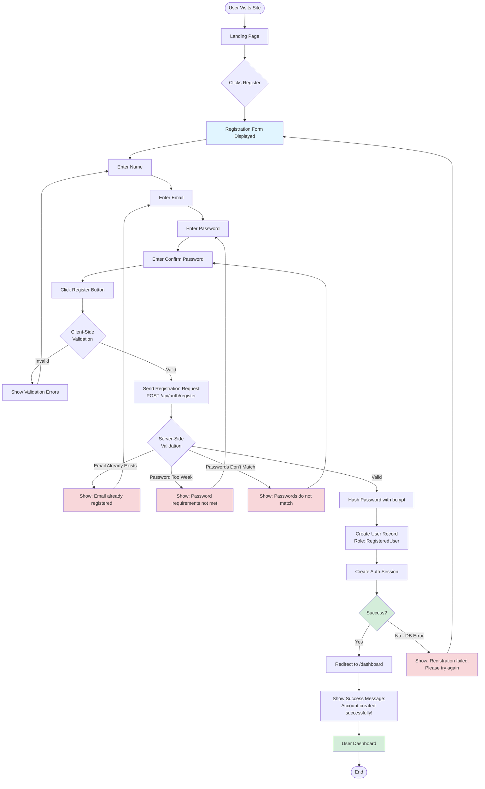

# UC018 — User Flow Diagram

## User Journey Summary

1. **Entry Point**: User clicks "Register" from navigation or landing page
2. **Input Phase**: User fills out 4-field form (name, email, password, confirm)
3. **Validation Phase**: Client-side validation provides immediate feedback
4. **Submission Phase**: Server validates and checks for existing email
5. **Creation Phase**: Password hashed, user record created, session established
6. **Success Phase**: Redirect to dashboard with welcome message
7. **Error Handling**: Clear, specific errors guide user to fix issues

## Key Decision Points

- **Client Validation**: Catches obvious errors before server request
- **Email Uniqueness Check**: Prevents duplicate accounts
- **Password Strength**: Enforces security requirements
- **Auto-Login**: Creates session immediately after registration

## Exit Points

- **Success**: User lands on dashboard as authenticated RegisteredUser
- **Errors**: User remains on form with guidance to correct issues
