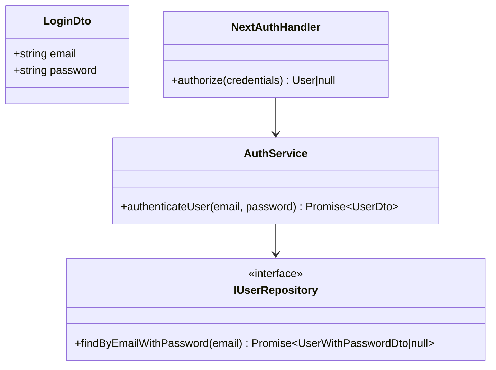

# UC019 — Design Class Diagram (DCD)

```mermaid
classDiagram
  class LoginDto {
    +string email
    +string password
  }

  class AuthService {
    +authenticateUser(email, password) Promise~UserDto~
  }

  class IUserRepository {
    <<interface>>
    +findByEmailWithPassword(email) Promise~UserWithPasswordDto|null~
  }

  class NextAuthHandler {
    +authorize(credentials) User|null
  }

  NextAuthHandler --> AuthService
  AuthService --> IUserRepository
```
