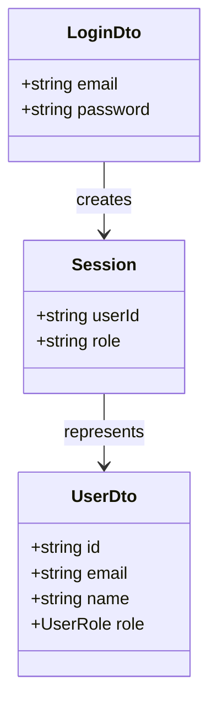

# UC019 — Domain Model (DM)

```mermaid
classDiagram
  class LoginDto {
    +string email
    +string password
  }

  class UserDto {
    +string id
    +string email
    +string name
    +UserRole role
  }

  class Session {
    +string userId
    +string role
  }

  LoginDto --> Session : creates
  Session --> UserDto : represents
```
