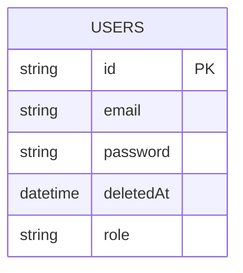

# UC019 — Entity Relationship Diagram (ERD)

```mermaid
erDiagram
  USERS {
    string id PK
    string email
    string password
    datetime deletedAt
    string role
  }
```

Notes:

- UC019 reads from `users` only.
- No schema change required.
