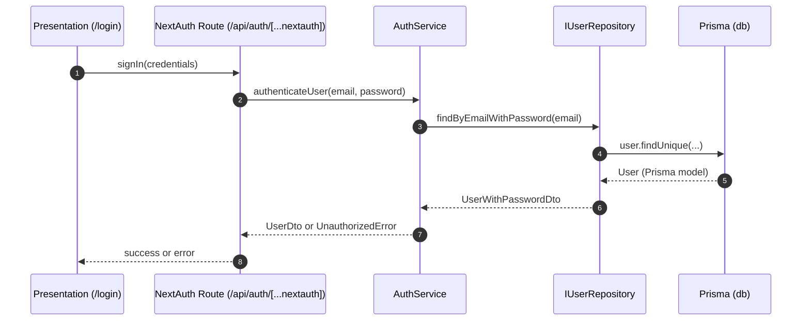

# UC019 — Sequence Diagram (SD)

```mermaid
sequenceDiagram
  autonumber
  participant UI as Presentation (/login)
  participant NA as NextAuth Route (/api/auth/[...nextauth])
  participant AUTH as AuthService
  participant UREPO as IUserRepository
  participant DB as Prisma (db)

  UI->>NA: signIn(credentials)
  NA->>AUTH: authenticateUser(email, password)
  AUTH->>UREPO: findByEmailWithPassword(email)
  UREPO->>DB: user.findUnique(...)
  DB-->>UREPO: User (Prisma model)
  UREPO-->>AUTH: UserWithPasswordDto
  AUTH-->>NA: UserDto or UnauthorizedError
  NA-->>UI: success or error
```
