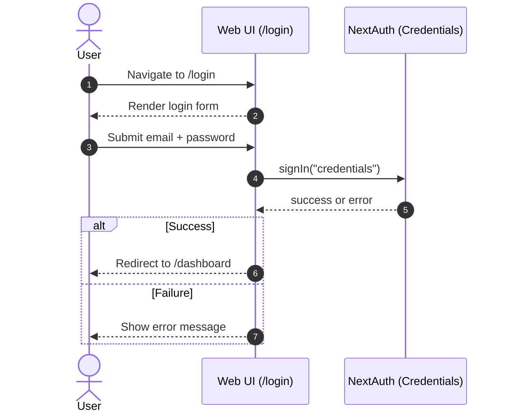

# UC019 — System Sequence Diagram (SSD)

```mermaid
sequenceDiagram
  autonumber
  actor User
  participant UI as Web UI (/login)
  participant NA as NextAuth (Credentials)

  User->>UI: Navigate to /login
  UI-->>User: Render login form
  User->>UI: Submit email + password
  UI->>NA: signIn("credentials")
  NA-->>UI: success or error

  alt Success
    UI-->>User: Redirect to /dashboard
  else Failure
    UI-->>User: Show error message
  end
```
