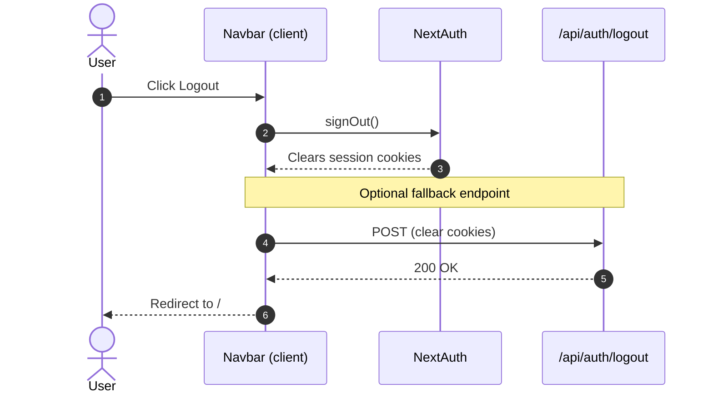

# UC020 — Sequence Diagram (SD)

```mermaid
sequenceDiagram
  autonumber
  actor User
  participant Navbar as Navbar (client)
  participant NextAuth as NextAuth
  participant LogoutAPI as /api/auth/logout

  User->>Navbar: Click Logout
  Navbar->>NextAuth: signOut()
  NextAuth-->>Navbar: Clears session cookies

  note over Navbar,LogoutAPI: Optional fallback endpoint
  Navbar->>LogoutAPI: POST (clear cookies)
  LogoutAPI-->>Navbar: 200 OK

  Navbar-->>User: Redirect to /
```
