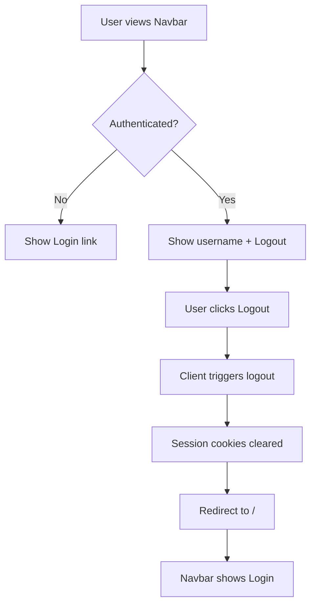

# UC020 — User Flow Diagram

```mermaid
flowchart TD
  A[User views Navbar] --> B{Authenticated?}
  B -->|No| C[Show Login link]
  B -->|Yes| D[Show username + Logout]

  D --> E[User clicks Logout]
  E --> F[Client triggers logout]
  F --> G[Session cookies cleared]
  G --> H[Redirect to /]
  H --> I[Navbar shows Login]
```
