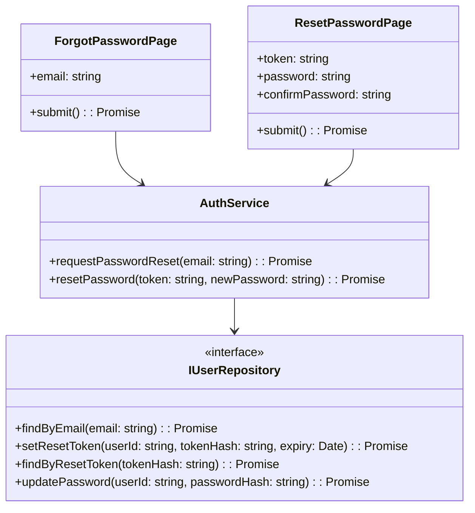

# UC021 — Design Class Diagram (DCD)

```mermaid
classDiagram
  class ForgotPasswordPage {
    +email: string
    +submit(): Promise<void>
  }

  class ResetPasswordPage {
    +token: string
    +password: string
    +confirmPassword: string
    +submit(): Promise<void>
  }

  class AuthService {
    +requestPasswordReset(email: string): Promise<void>
    +resetPassword(token: string, newPassword: string): Promise<void>
  }

  class IUserRepository {
    <<interface>>
    +findByEmail(email: string): Promise<UserDto | null>
    +setResetToken(userId: string, tokenHash: string, expiry: Date): Promise<void>
    +findByResetToken(tokenHash: string): Promise<PasswordResetUserDto | null>
    +updatePassword(userId: string, passwordHash: string): Promise<void>
  }

  ForgotPasswordPage --> AuthService
  ResetPasswordPage --> AuthService
  AuthService --> IUserRepository
```
