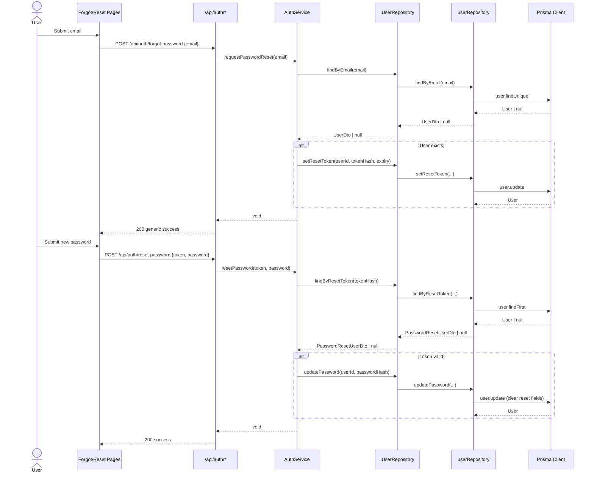

# UC021 — Sequence Diagram (Clean Architecture)

```mermaid
sequenceDiagram
  actor User
  participant UI as Forgot/Reset Pages
  participant API as /api/auth/*
  participant Service as AuthService
  participant Repo as IUserRepository
  participant RepoImpl as userRepository
  participant DB as Prisma Client

  User->>UI: Submit email
  UI->>API: POST /api/auth/forgot-password {email}
  API->>Service: requestPasswordReset(email)
  Service->>Repo: findByEmail(email)
  Repo->>RepoImpl: findByEmail(email)
  RepoImpl->>DB: user.findUnique
  DB-->>RepoImpl: User | null
  RepoImpl-->>Repo: UserDto | null
  Repo-->>Service: UserDto | null
  alt User exists
    Service->>Repo: setResetToken(userId, tokenHash, expiry)
    Repo->>RepoImpl: setResetToken(...)
    RepoImpl->>DB: user.update
    DB-->>RepoImpl: User
  end
  Service-->>API: void
  API-->>UI: 200 generic success

  User->>UI: Submit new password
  UI->>API: POST /api/auth/reset-password {token, password}
  API->>Service: resetPassword(token, password)
  Service->>Repo: findByResetToken(tokenHash)
  Repo->>RepoImpl: findByResetToken(...)
  RepoImpl->>DB: user.findFirst
  DB-->>RepoImpl: User | null
  RepoImpl-->>Repo: PasswordResetUserDto | null
  Repo-->>Service: PasswordResetUserDto | null
  alt Token valid
    Service->>Repo: updatePassword(userId, passwordHash)
    Repo->>RepoImpl: updatePassword(...)
    RepoImpl->>DB: user.update (clear reset fields)
    DB-->>RepoImpl: User
  end
  Service-->>API: void
  API-->>UI: 200 success
```
