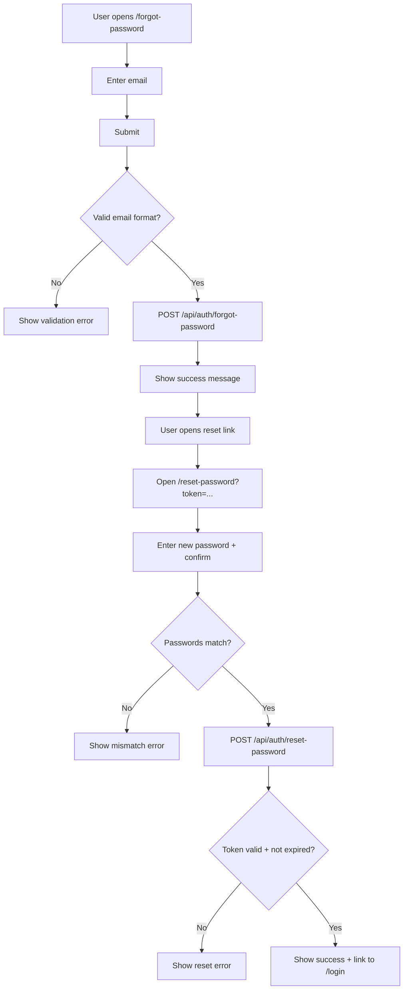

# UC021 — User Flow Diagram

```mermaid
flowchart TD
  A[User opens /forgot-password] --> B[Enter email]
  B --> C[Submit]
  C --> D{Valid email format?}
  D -- No --> E[Show validation error]
  D -- Yes --> F[POST /api/auth/forgot-password]
  F --> G[Show success message]
  G --> H[User opens reset link]
  H --> I[Open /reset-password?token=...]
  I --> J[Enter new password + confirm]
  J --> K{Passwords match?}
  K -- No --> L[Show mismatch error]
  K -- Yes --> M[POST /api/auth/reset-password]
  M --> N{Token valid + not expired?}
  N -- No --> O[Show reset error]
  N -- Yes --> P[Show success + link to /login]
```
