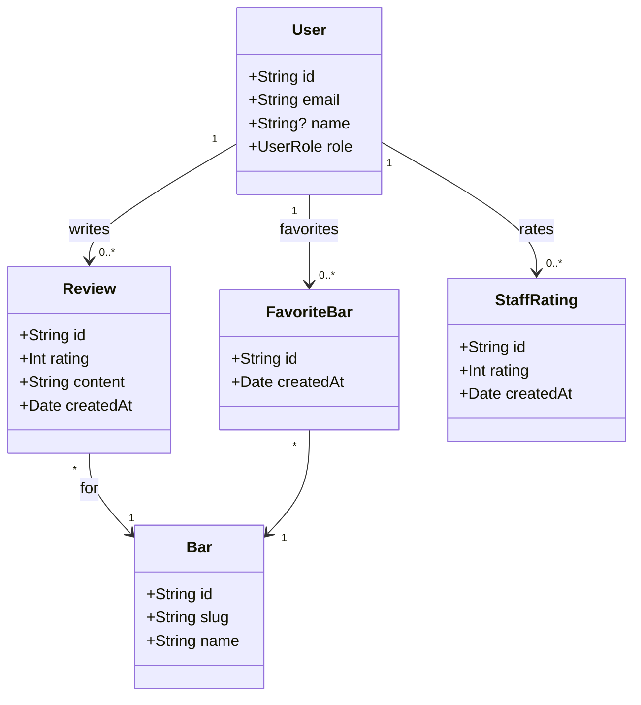

# UC022 — Domain Model (DM)

```mermaid
classDiagram
  class User {
    +String id
    +String email
    +String? name
    +UserRole role
  }

  class Bar {
    +String id
    +String slug
    +String name
  }

  class Review {
    +String id
    +Int rating
    +String content
    +Date createdAt
  }

  class FavoriteBar {
    +String id
    +Date createdAt
  }

  class StaffRating {
    +String id
    +Int rating
    +Date createdAt
  }

  User "1" --> "0..*" Review : writes
  Review "*" --> "1" Bar : for

  User "1" --> "0..*" FavoriteBar : favorites
  FavoriteBar "*" --> "1" Bar

  User "1" --> "0..*" StaffRating : rates
```
