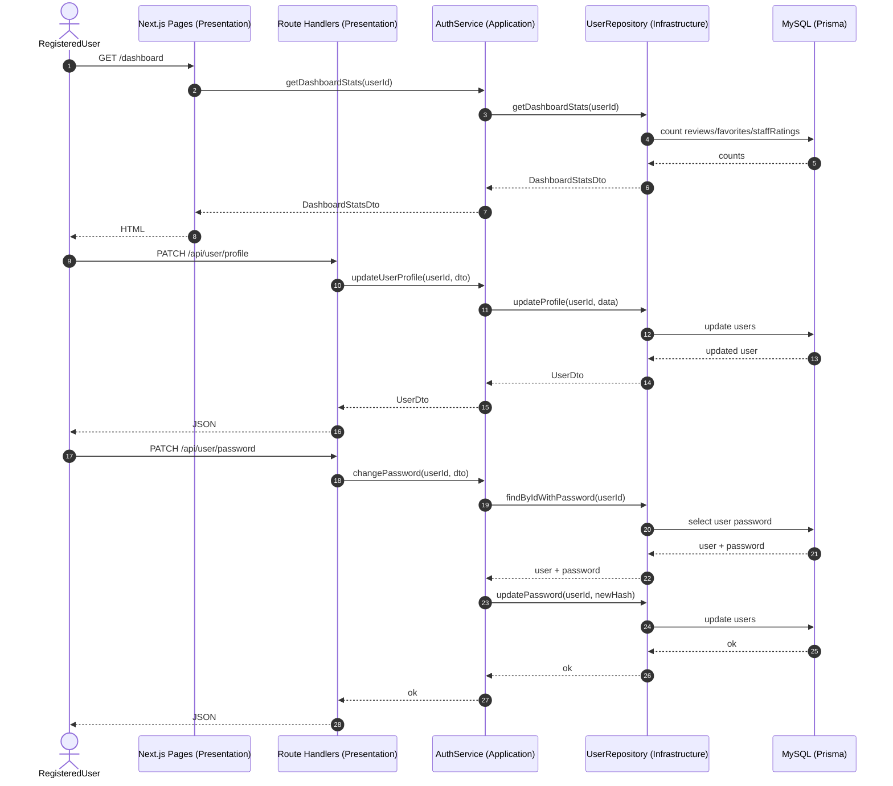

# UC022 — Sequence Diagram (Layers)

```mermaid
sequenceDiagram
  autonumber
  actor U as RegisteredUser
  participant UI as Next.js Pages (Presentation)
  participant API as Route Handlers (Presentation)
  participant S as AuthService (Application)
  participant R as UserRepository (Infrastructure)
  participant DB as MySQL (Prisma)

  U->>UI: GET /dashboard
  UI->>S: getDashboardStats(userId)
  S->>R: getDashboardStats(userId)
  R->>DB: count reviews/favorites/staffRatings
  DB-->>R: counts
  R-->>S: DashboardStatsDto
  S-->>UI: DashboardStatsDto
  UI-->>U: HTML

  U->>API: PATCH /api/user/profile
  API->>S: updateUserProfile(userId, dto)
  S->>R: updateProfile(userId, data)
  R->>DB: update users
  DB-->>R: updated user
  R-->>S: UserDto
  S-->>API: UserDto
  API-->>U: JSON

  U->>API: PATCH /api/user/password
  API->>S: changePassword(userId, dto)
  S->>R: findByIdWithPassword(userId)
  R->>DB: select user password
  DB-->>R: user + password
  R-->>S: user + password
  S->>R: updatePassword(userId, newHash)
  R->>DB: update users
  DB-->>R: ok
  R-->>S: ok
  S-->>API: ok
  API-->>U: JSON
```
