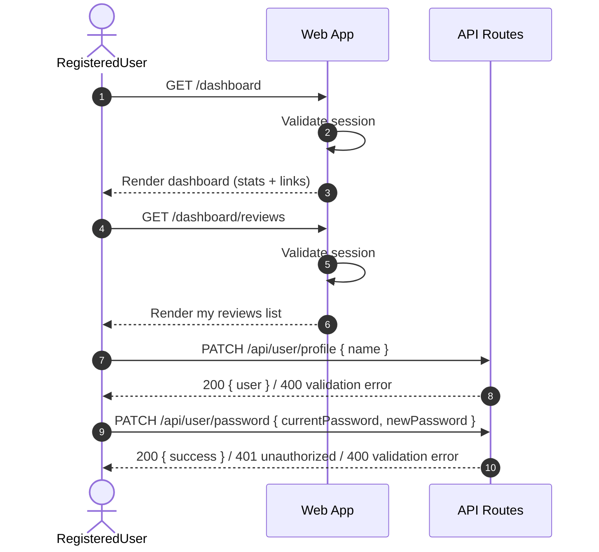

# UC022 — System Sequence Diagram (SSD)

```mermaid
sequenceDiagram
  autonumber
  actor U as RegisteredUser
  participant W as Web App
  participant API as API Routes

  U->>W: GET /dashboard
  W->>W: Validate session
  W-->>U: Render dashboard (stats + links)

  U->>W: GET /dashboard/reviews
  W->>W: Validate session
  W-->>U: Render my reviews list

  U->>API: PATCH /api/user/profile { name }
  API-->>U: 200 { user } / 400 validation error

  U->>API: PATCH /api/user/password { currentPassword, newPassword }
  API-->>U: 200 { success } / 401 unauthorized / 400 validation error
```
