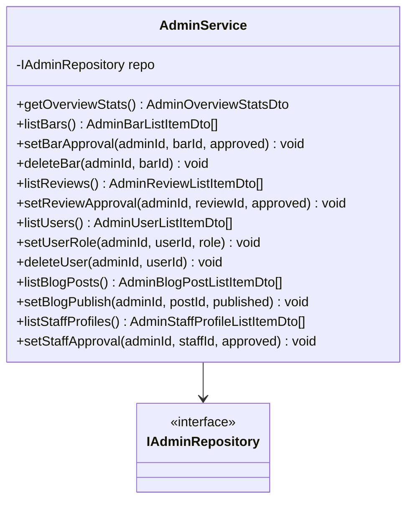

# UC023 — Design Class Diagram (DCD)

```mermaid
classDiagram
  class AdminService {
    -IAdminRepository repo
    +getOverviewStats() AdminOverviewStatsDto
    +listBars() AdminBarListItemDto[]
    +setBarApproval(adminId, barId, approved) void
    +deleteBar(adminId, barId) void
    +listReviews() AdminReviewListItemDto[]
    +setReviewApproval(adminId, reviewId, approved) void
    +listUsers() AdminUserListItemDto[]
    +setUserRole(adminId, userId, role) void
    +deleteUser(adminId, userId) void
    +listBlogPosts() AdminBlogPostListItemDto[]
    +setBlogPublish(adminId, postId, published) void
    +listStaffProfiles() AdminStaffProfileListItemDto[]
    +setStaffApproval(adminId, staffId, approved) void
  }

  class IAdminRepository {
    <<interface>>
  }

  AdminService --> IAdminRepository
```
