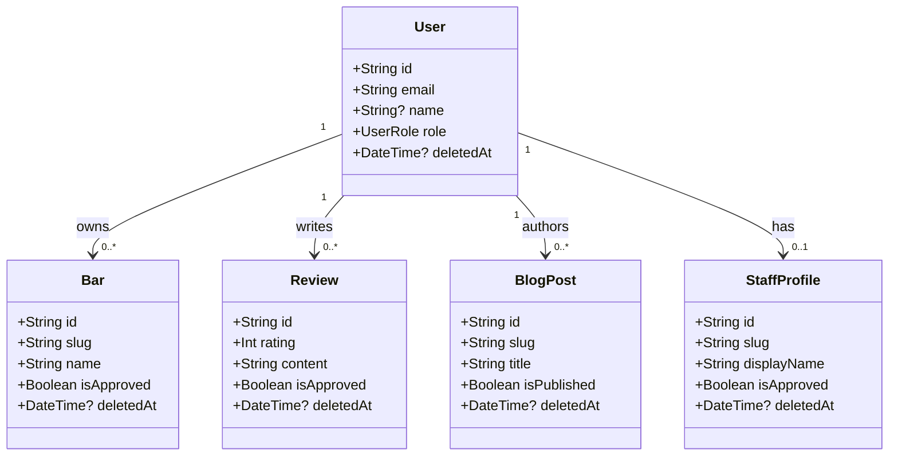

# UC023 — Domain Model (DM)

```mermaid
classDiagram
  class User {
    +String id
    +String email
    +String? name
    +UserRole role
    +DateTime? deletedAt
  }

  class Bar {
    +String id
    +String slug
    +String name
    +Boolean isApproved
    +DateTime? deletedAt
  }

  class Review {
    +String id
    +Int rating
    +String content
    +Boolean isApproved
    +DateTime? deletedAt
  }

  class BlogPost {
    +String id
    +String slug
    +String title
    +Boolean isPublished
    +DateTime? deletedAt
  }

  class StaffProfile {
    +String id
    +String slug
    +String displayName
    +Boolean isApproved
    +DateTime? deletedAt
  }

  User "1" --> "0..*" Bar : owns
  User "1" --> "0..*" Review : writes
  User "1" --> "0..*" BlogPost : authors
  User "1" --> "0..1" StaffProfile : has
```
