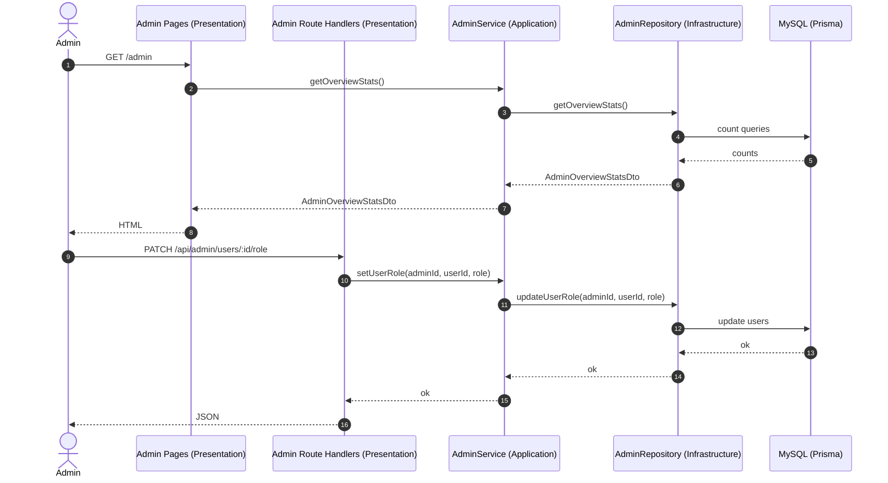

# UC023 — Sequence Diagram (Layers)

```mermaid
sequenceDiagram
  autonumber
  actor A as Admin
  participant UI as Admin Pages (Presentation)
  participant API as Admin Route Handlers (Presentation)
  participant S as AdminService (Application)
  participant R as AdminRepository (Infrastructure)
  participant DB as MySQL (Prisma)

  A->>UI: GET /admin
  UI->>S: getOverviewStats()
  S->>R: getOverviewStats()
  R->>DB: count queries
  DB-->>R: counts
  R-->>S: AdminOverviewStatsDto
  S-->>UI: AdminOverviewStatsDto
  UI-->>A: HTML

  A->>API: PATCH /api/admin/users/:id/role
  API->>S: setUserRole(adminId, userId, role)
  S->>R: updateUserRole(adminId, userId, role)
  R->>DB: update users
  DB-->>R: ok
  R-->>S: ok
  S-->>API: ok
  API-->>A: JSON
```
