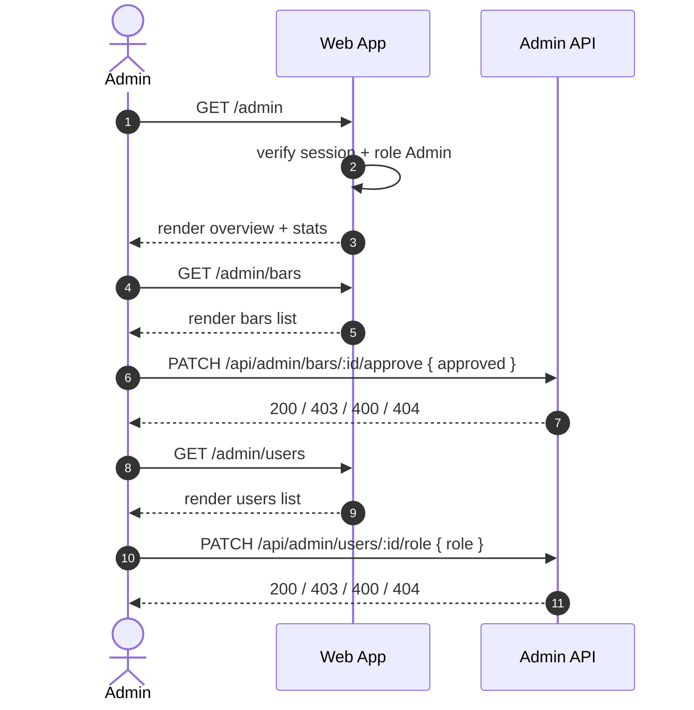

# UC023 — System Sequence Diagram (SSD)

```mermaid
sequenceDiagram
  autonumber
  actor A as Admin
  participant W as Web App
  participant API as Admin API

  A->>W: GET /admin
  W->>W: verify session + role Admin
  W-->>A: render overview + stats

  A->>W: GET /admin/bars
  W-->>A: render bars list
  A->>API: PATCH /api/admin/bars/:id/approve { approved }
  API-->>A: 200 / 403 / 400 / 404

  A->>W: GET /admin/users
  W-->>A: render users list
  A->>API: PATCH /api/admin/users/:id/role { role }
  API-->>A: 200 / 403 / 400 / 404
```
